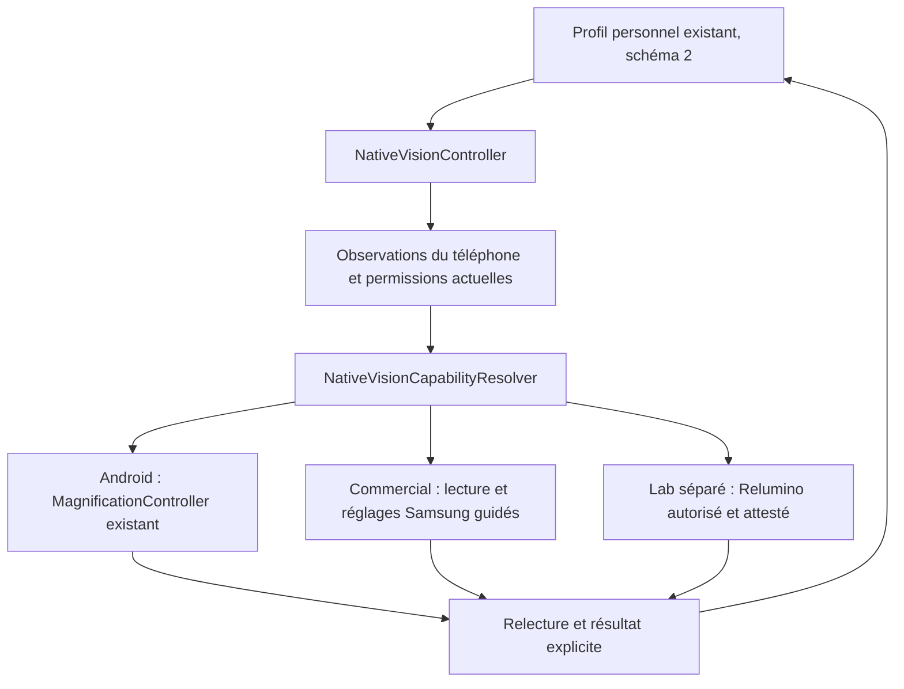

# Native Vision — incrément du 25 septembre 2026

## Périmètre

Native Vision ajoute une couche aux fonctions et recherches existantes : loupe, lecture, égaliseur, profil, calibration, bilan visuel, VueConfort Vision et travaux Display-Lens. Ce patrimoine est conservé ; sa présence ne signifie pas que chaque moteur est déjà intégré ou validé commercialement. Cet incrément orchestre les aides Android/Samsung, sans capture de l’écran ni reconstruction du grossissement. La préférence demandée est distincte du résultat observé. Son périmètre décrit les voies implémentées à cette date, sans exclure une orchestration ultérieure avec les moteurs VueConfort. Il ne réalise pas Display-Lens, ne calcule pas de correction optique depuis une ordonnance et ne démontre pas le remplacement de lunettes.

Les traitements de l’égaliseur restent appliqués à son aperçu. Chaque aide native garde sa portée Android/Samsung. Netteté n’est pas Relumino ; épaisseur du texte n’est pas épaisseur des contours ; lumière douce, atténuation supplémentaire et confort visuel Samsung sont distincts.

## Variantes

| Variante | Identifiant | Native Vision | Privilège de développement |
|---|---|---|---|
| Release | `fr.vueconfort.app` | Voies publiques et guidage | Aucun |
| Aperçu | `fr.vueconfort.app.preview` | Voie commerciale, paquet d’essai isolé | Aucun |
| Lab | `fr.vueconfort.app.lab` | Voie publique et commandes Samsung qualifiées | `WRITE_SECURE_SETTINGS`, seulement si accordée explicitement pour l’essai |
| Debug | `fr.vueconfort.app.debug` | Factory Native Vision commerciale ; recherches historiques distinctes | Aucun privilège Native Vision ajouté |

`src/nativeCommercial` fournit une factory sans passerelle Lab. `src/lab` contient seul le manifeste de permission, les écritures Secure, les transactions et leur journal. Lab et Aperçu utilisent le pont de loupe Release, sans réintroduire le prototype de capture Debug. La Release ne demande ni `WRITE_SETTINGS`, ni ADB, ni Shizuku, ni root. L’application ne s’accorde aucune permission elle-même.

## Accès réellement prévu pour un client ordinaire

| Capacité | Commercial/Aperçu | Lab sur S25 attesté | Limite |
|---|---|---|---|
| Grossissement | API publique après activation volontaire du service | Même voie publique | Nouvelle orchestration : Android 14+, service connecté, état complet restaurable |
| Relumino | Réglage guidé et relecture, sinon confirmation utilisateur | Automatique avec permission explicite et attestation | Cinq crans et quatre couleurs ; aucun paramètre optique |
| Extra Dim | Action utilisateur | Action utilisateur | Lecture Secure refusée à l’APK sur S25 ; commande Lab non qualifiée |
| Filtre coloré Samsung | Action utilisateur | Action utilisateur | Activation, couleur et opacité séparées |
| Correction des couleurs | Action utilisateur | Action utilisateur | Fonction d’accessibilité, distincte du contraste |
| Inversion | Action utilisateur | Action utilisateur | Jamais déclenchée implicitement par un autre curseur |
| Contraste des polices | Action utilisateur | Action utilisateur | Ne traite pas toutes les images |
| Confort visuel Samsung | Action utilisateur | Action utilisateur | Aucune API OEM grand public automatique démontrée |
| Luminosité du système | Action utilisateur | Action utilisateur | Aucun setter `WRITE_SETTINGS` ajouté |
| Taille des polices | Action utilisateur | Action utilisateur | Guidage vers les paramètres d’écran |
| Zoom de l’écran | Action utilisateur | Action utilisateur | Aucune modification DPI privée |

Une configuration manuelle Samsung ne donne pas ensuite le pilotage automatique à VueConfort. Pour une autre valeur Relumino commerciale, le client utilise encore Samsung. Les réglages peuvent rester actifs après fermeture de VueConfort, suivant Android/Samsung.

**Correction de la qualification Extra Dim :** l’essai du 24 septembre utilisait l’identité shell ADB. Il ne prouve pas l’accès d’une APK disposant de `WRITE_SECURE_SETTINGS`. Le contrôle de lisibilité s’applique aussi à l’APK Lab ; un refus de lecture ne devient jamais « clé absente ». Seule Relumino est actuellement autorisée par l’attestation Lab. Les mappings typés futurs restent inaccessibles à la commande tant que le resolver ne les qualifie pas.

## Resolver

`NativeVisionEnvironment` collecte les faits à l’ouverture, au retour et avant commande. Le resolver pur distingue présence, lisibilité, route de réglages, API publique, permission, contexte et attestation Lab.

La marque Samsung seule ne prouve rien. L’attestation actuelle vise Samsung `SM-S931B`, API 36, incrément `S931BXXSCCZH1`. La version One UI provient de cette attestation ; ailleurs, elle peut rester inconnue. Aucune propriété cachée, réflexion, shell ou lecture interutilisateur n’est utilisée. Une activité dédiée autorisée ou des paramètres cohérents sont d’autres indices ; une page générale d’accessibilité ne prouve pas Relumino.

Les états sont `AVAILABLE_PUBLIC`, `AVAILABLE_WITH_USER_PERMISSION`, `AVAILABLE_USER_ACTION`, `AVAILABLE_LAB_ONLY`, `UNAVAILABLE`, `UNSUPPORTED_DEVICE` et `REJECTED`. Le drapeau `canApplyAutomatically` est évalué séparément : une voie Lab identifiée n’implique pas une permission accordée. Sur un autre OEM, les capacités Samsung deviennent non prises en charge sans bloquer le reste de VueConfort.

## Adaptateurs

`AndroidNativeVisionAdapter` utilise le contrôleur de `ScreenMagnifierService`. Il lit activation, mode, facteur et centre, sans enregistrer un second profil de loupe. Si une activation exacte ou une géométrie restaurable manque, il propose un guidage. Sur Android plus ancien, les commandes historiques conservent leur comportement.

`SamsungNativeVisionAdapter` commercial lit uniquement des clés scalaires connues et distingue présence, absence, refus et erreur. Il n’a aucun setter Secure. Une configuration manuelle techniquement confirmée reste `NEEDS_USER_ACTION` avec `READ_BACK_CONFIRMED`, jamais `APPLIED_AUTO`. Une confirmation humaine reste `USER_CONFIRMED` et n’écrase pas une contradiction connue.

Avant chaque ouverture, les activités sont contrôlées : application système, activité exportée et activée, permission éventuelle détenue. L’inspection du firmware n’a trouvé aucune activité Relumino directement utilisable par l’APK ordinaire. Le raccourci protégé n’est pas lancé : `ACTION_ACCESSIBILITY_SETTINGS` ouvre la page générale et l’interface indique **Améliorations pour la vision → Contour Relumino**. Extra Dim, filtre coloré, correction et contraste des polices peuvent avoir une page dédiée. Eye Comfort revient à Affichage si la permission OEM de sa page n’est pas détenue.

`SamsungNativeVisionLabAdapter` utilise l’UID de l’application, sans shell intégré. Relumino accepte seulement activation 0/1, épaisseur 1.0/2.0/3.0/4.0/4.99 et type adaptatif/noir/blanc/vert. Le succès d’une commande n’autorise aucune autre fonction Samsung.

## Profil et résultats

`EqualizerProfile` passe au schéma 2. Son champ `nativeVision` contient demandes, recommandations, résultats, capacités, politique de désactivation et références de restauration. Le sous-modèle et les capacités Native Vision ont leur version indépendante 1. Le profil historique est migré en mémoire, puis persisté lors d’une écriture explicite. Un profil inconnu n’est pas remplacé par des valeurs neutres.

`VisualProfileRepository.updateNativeVision` modifie atomiquement ce sous-ensemble. Un ancien brouillon d’égaliseur ne peut écraser une demande native plus récente. Le bilan, la lecture et les profils historiques de loupe restent distincts.

Chaque résultat porte capacité, demande, valeur observée, moteur, provenance, raison, date, révision et restauration possible. Les états sont `APPLIED_AUTO`, `APPLIED_LAB`, `NEEDS_USER_PERMISSION`, `NEEDS_USER_ACTION`, `UNAVAILABLE`, `UNSUPPORTED`, `REJECTED` et `ERROR`. `currentResult` n’affiche pas comme actuelle une confirmation d’une autre révision ou valeur.

Le contrôleur possède une file fusionnant les demandes et un seul propriétaire d’écriture. Une nouvelle position remplace les commandes encore en attente. La désactivation invalide les commandes antérieures avant restauration. Le temps commande/relecture n’est pas une mesure de latence de la dalle.

## Restauration

L’état précédent est durablement enregistré avant une commande automatique. Le grossissement utilise un fichier atomique privé ; le Lab utilise un journal privé de transactions. Ces journaux ne sont pas des profils concurrents et ne contiennent ni captures ni bilan.

Avant restauration, l’état actuel est comparé à celui de la session. Un changement extérieur est préservé et le journal reste disponible. Permission retirée, journal illisible ou contexte incompatible laissent la restauration en attente. Une clé absente doit redevenir absente ; une valeur présente est rétablie telle qu’elle était.

**Conserver les actuels** abandonne la session sans modifier l’affichage. **Restaurer les précédents** restaure puis vérifie. Fermer un écran ne restaure pas implicitement les paramètres. Les réglages manuels Samsung restent sous le contrôle de l’utilisateur. Supprimer le profil n’efface pas une restauration en attente. Désinstaller ou effacer les données supprime les journaux sans nécessairement réinitialiser Android : restaurer avant si souhaité.

## Confidentialité et limites

Native Vision transmet des paramètres sans capture, MediaProjection, OCR permanent, réseau ou lecture des contenus d’applications. Le lecteur historique **Lire** reste une extraction textuelle distincte, sur demande. L’import du bilan conserve son OCR local et sa confirmation obligatoire ; il n’alimente pas une correction optique globale.

Une valeur relue confirme un paramètre, pas une amélioration de la vue ou le traitement final de la dalle. L’observation utilisateur du 24 septembre concerne le banc de cette date : elle ne valide pas chaque nouveau binaire, firmware, contenu protégé, autonomie ou fréquence d’affichage.

## Preuves de recette à compléter

Le [rapport de validation du 25 septembre](NATIVE_VISION_VALIDATION_2026-09-25.md) rassemble les résultats obtenus et les étapes encore en cours, sans assimiler les tests ignorés à des réussites.

Les tests couvrent modèles, migrations, révisions, accès, valeurs bornées, absence et interruption. Les tests Aperçu vérifient manifeste, guidage, absence d’écriture protégée et navigation. Le grossissement est explicitement ignoré si son service ou son état restaurable manque. Les tests d’interaction sans capture ne prouvent pas les pixels.

| Niveau | À reporter par l’intégrateur |
|---|---|
| Codé | Sources et tests présents dans la branche |
| Compilé | Variantes et sortie finale de construction |
| Tests unitaires/instrumentés | Rapports et tests ignorés, séparés des réussites |
| Exécuté S25 commercial | Reçus `native-vision-commercial-*` du binaire testé |
| Exécuté S25 Lab | Permission, Relumino, relecture et restauration, séparément |
| Observé par l’utilisateur | Observation de cette recette, sans reprendre tacitement celle du 24 septembre |
| Commercialisable / Play | Aucune approbation déduite de tests ; voir [préparation Play](PLAY_STORE_READINESS.md) |

Sources de tests : [commercial](../app/src/androidTestPreview/java/fr/vueconfort/app/nativevision/NativeVisionCommercialDeviceTest.kt), [navigation](../app/src/androidTestPreview/java/fr/vueconfort/app/nativevision/NativeVisionNavigationDeviceTest.kt), [égaliseur sans capture](../app/src/androidTestPreview/java/fr/vueconfort/app/equalizer/EqualizerSemanticsDeviceTest.kt). Le rapport final complète les preuves effectivement obtenues. Ce document ne publie aucun binaire ni aucune politique sur le Web.
